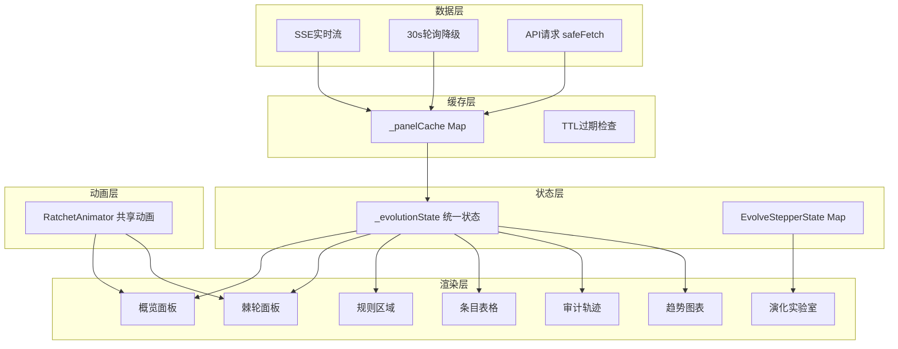

## 用户需求

对 `system-evolution.html` 页面进行全面优化，提升性能、实时性、用户体验和代码质量，保持现有7面板架构不变。

## 产品概述

系统演进页面是 AgentsGroup2026 的合规治理中枢，通过达尔文棘轮机制确保系统只能向前演进、不可回退。页面包含7个功能面板：演进概览、达尔文棘轮、技能演化实验室、规则与区域、演进条目、审计轨迹、趋势分析。

## 核心优化目标

1. **性能优化**：面板切换时不重复请求（缓存机制）、API调用合并
2. **实时更新**：支持 WebSocket/轮询自动刷新关键指标
3. **加载体验**：骨架屏、进度条、明确的加载/错误/空数据三态
4. **错误处理**：统一错误装饰（request_id）、分类错误提示
5. **代码质量**：统一棘轮动画逻辑、状态集中管理、步进器状态保留
6. **缺失功能**：规则搜索、条目排序、审计分页、SVG趋势图
7. **无障碍与响应式**：ARIA标签、键盘导航、弹性侧边栏

## 技术选型

- **前端**：现有纯 HTML/CSS/JS 架构，不引入框架
- **数据缓存**：基于时间戳的轻量内存缓存（`_panelCache` map），默认30秒过期
- **实时更新**：SSE (Server-Sent Events) 替代 WebSocket（后端 `/api/v1/agent-teams/evolution/stream` 已存在），降级为30秒轮询
- **SVG图表**：纯 JS 操作 SVG DOM，复用 datacenter-ratchet-evolution.html 中的趋势图模式
- **响应式**：CSS Grid + clamp() 弹性侧边栏

## 实现方案

### 1. 缓存层（性能优化）

在 `system-evolution.js` 顶部新增 `_panelCache` 对象：

- 每个面板对应的 API 响应存入缓存，带 `timestamp` + `ttl`（默认30秒）
- `switchPanel` 时先检查缓存有效性，过期才重新请求
- `refreshAll` 时强制清空缓存
- Overview面板的 `compliance-rating` 缓存60秒（计算成本高），`items` 缓存15秒

### 2. 实时更新（SSE + 轮询降级）

- 优先建立 SSE 连接 `/api/v1/agent-teams/evolution/stream`
- 收到事件后增量更新 KPI 卡片和近期条目（不重新渲染整个面板）
- SSE 断开时自动降级为30秒定时轮询
- 仅 Overview 面板订阅实时更新，其他面板按需加载

### 3. 加载体验三态

为每个面板容器实现统一的三态渲染：

- **加载态**：骨架屏（pulsing grey blocks 匹配实际内容布局）
- **错误态**：显示具体错误信息 + request_id + 重试按钮
- **空数据态**：友好的空状态插图 + 引导文字（如"点击运行审查开始"）

### 4. 错误处理统一化

- 封装 `safeFetch(url, options)` 函数，自动附加 request_id
- 错误时调用 `window.api.decorateErrorMessage`（已存在）
- 分类处理：网络错误（提示刷新）、业务错误（显示detail）、权限错误（跳转登录）

### 5. 代码去重与状态管理

- 抽取 `RatchetAnimator` 对象，统一 Overview 和 Ratchet 面板的棘轮动画
- 步进器状态（`_evDataset/_evBaseline/_evReflection/_evCandidates`）改为 `Map` 结构，key 为 `skill_id`，切换技能时自动恢复已构建的数据
- `_allRules/_allItems` 改为单一 `_evolutionState` 对象集中管理

### 6. 缺失功能实现

- **规则搜索**：在 `rules-zones` 面板增加 `input[type=search]`，客户端过滤规则标题/描述
- **条目排序**：表格表头点击排序（ID/标题/域/严重度/状态），本地排序
- **审计分页**：`loadTrail` 支持 `limit/offset` 参数，底部显示"加载更多"按钮
- **SVG趋势图**：在趋势面板用纯 SVG 绘制折线图（x轴=时间，y轴=合规分数），复用 datacenter-ratchet-evolution.html 的 `<svg>` 渲染模式

### 7. 无障碍

- 所有交互元素添加 `role` 和 `aria-label`
- 面板切换按钮添加 `aria-selected` 状态
- Tab面板添加 `tablist/tab/tabpanel` ARIA角色
- 支持 Tab/Shift+Tab 键盘导航

### 8. 响应式布局

- 侧边栏宽度改为 `clamp(200px, 18vw, 260px)`
- 小屏幕（<900px）时侧边栏变为顶部横向标签栏
- 表格在小屏幕时转为卡片堆叠视图

## 架构设计



## 目录结构

```
src/frontend/
├── system-evolution.html        # [MODIFY] 主页面，更新ARIA/响应式CSS/骨架屏HTML结构
├── js/
│   └── system-evolution.js      # [MODIFY] 核心逻辑，新增缓存层/SSE/状态管理/功能补全
```