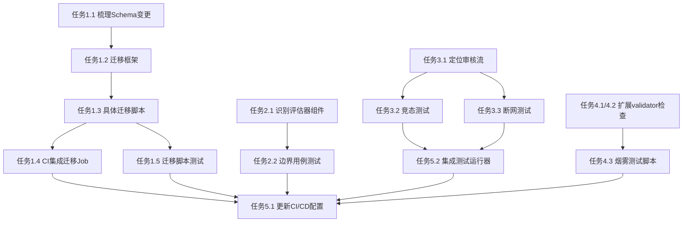

# PM分解 — project_manager

任务: CI/CD 集成 schema 迁移与端到端自动化测试：迁移脚本作为部署 Job 自动执行，评估器边界用例覆盖，审核流竞态与断网场景测试，烟雾测试验证索引就绪与 SkillStore 完整性。
步骤: pm_decompose
Agent: build_pm

---

📋 任务: e9781ac4-a03
🤖 Agent: PM (project_manager)
📂 工作目录: /Users/panglaohu/Downloads/AgentsGroup2026
🔧 执行方式: DeepSeek API (直连)
⏱️ 超时: 1200s
────────────────────────────────────────────────────────────
📝 提示词:
  你是 AgentsGroup2026 系统的 PM (project_manager)。
  请执行以下开发任务:
  
  你是项目经理 (PM)。请对以下任务进行分解和规划:
  
  ## 任务
  CI/CD 集成 schema 迁移与端到端自动化测试：迁移脚本作为部署 Job 自动执行，评估器边界用例覆盖，审核流竞态与断网场景测试，烟雾测试验证索引就绪与 SkillStore 完整性。
  Deployer, 测试工程师
  
  ## 📂 项目上下文 (系统自动预加载)
  
  ### 项目文件结构 (src/ 目录)
  ```
  src/frontend/agent-team-config.html
  src/frontend/index.html
  src/frontend/login.html
  src/frontend/plaza-dark.html
  src/frontend/plaza-old.html
  src/frontend/plaza-wabisabi-v2.html
  src/frontend/plaza-wabisabi.html
  src/frontend/plaza.html
  src/frontend/system-evolution.html
  src/frontend/tasks.html
  src/frontend/css/agent-team-config.css
  src/frontend/css/openbridge-theme.css
  src/frontend/css/ws-theme-bridge.css
  src/frontend/js/agent-team-config.js
  src/frontend/js/i18n.js
  src/frontend/js/nav-sidebar.js
  src/backend/__init__.py
  src/backend/agent_team_api.py
  src/backend/main.py
  src/backend/main.py.bak
  src/backend/startup_check.py
  src/backend/startup_validator.py
  src/backend/tests/__init__.py
  src/backend/tests/conftest.py
  src/backend/tests/conftest.py.bak
  src/backend/tests/test_ab_testing.py
  src/backend/tests/test_agent_toolbox.py
  src/backend/tests/test_models.py
  src/backend/tests/test_models.py.bak
  src/backend/tests/test_task_engine.py
  src/backend/tests/test_task_engine.py.bak
  src/backend/tests/test_team_manager.py
  src/backend/tests/test_team_manager.py.bak
  src/backend/agents/__init__.py
  src/backend/agents/ab_testing.py
  src/backend/agents/agent_loop.py
  src/backend/agents/agent_toolbox.py
  src/backend/agents/api.py
  src/backend/agents/chat_harness.py
  src/backend/agents/execution_registry.py
  src/backend/agents/hermes_research.py
  src/backend/agents/knowledge_base.py
  src/backend/agents/models.py
  src/backend/agents/plaza.py
  src/backend/agents/plaza_engine.py
  src/backend/agents/plaza_routes.py
  src/backend/agents/plaza_routes.py.bak
  src/backend/agents/plaza_store.py
  src/backend/agents/session_store.py
  src/backend/agents/skill_registry.py
  src/backend/agents/task_engine.py
  src/backend/agents/task_store.py
  src/backend/agents/team_manager.py
  src/backend/agents/team_store.py
  src/backend/agents/tool_executor.py
  src/backend/agents/tool_registry.py
  src/backend/agents/tts_routes.py
  src/backend/agents/teams/__init__.py
  src/backend/agents/teams/ai_coding_team.py
  src/backend/agents/teams/build_team.py
  src/backend/agents/teams/energy_team.py
  src/backend/agents/skills/__init__.py
  src/backend/agents/skills/greeting.py
  src/backend/agents/skills/hello.py
  src/backend/scripts/__init__.py
  src/backend/scripts/validate_startup.py
  src/backend/scripts/validate_telemetry.py
  src/backend/monitoring/__init__.py
  src/backend/monitoring/collector.py
  src/backend/monitoring/models.py
  src/backend/monitoring/plaza_monitor.py
  src/backend/monitoring/plaza_monitor.py.bak
  src/backend/monitoring/sampler.py
  src/backend/channels/__init__.py
  src/backend/channels/bridge_chat.py
  src/backend/channels/evolution_executor.py
  src/backend/channels/marine_base.py
  src/backend/channels/openclaw_sync.py
  src/backend/channels/openclaw_sync.py.bak
  src/backend/channels/system_evolution.py
  src/docs/agent_handoffs/01d37305-090_executor_started_20260509T073232.md
  src/docs/agent_handoffs/0261754d-288_executor_started_20260509T073231.md
  src/docs/agent_handoffs/05014547-ce8_executor_started_20260509T073232.md
  src/docs/agent_handoffs/0597d622-ad4_executor_started_20260509T073232.md
  src/docs/agent_handoffs/06d3f2a5-82c_executor_started_20260509T073231.md
  src/docs/agent_handoffs/073864e5-58b_executor_started_20260509T073231.md
  src/docs/agent_handoffs/073a3fe7-4d5_executor_started_20260509T073232.md
  src/docs/agent_handoffs/09ff3a16-710_executor_started_20260509T073231.md
  src/docs/agent_handoffs/0a242acf-f52_executor_started_20260509T073232.md
  src/docs/agent_handoffs/0af6e1cb-61c_executor_started_20260509T073231.md
  src/docs/agent_handoffs/0c263083-1c8_executor_started_20260509T073231.md
  src/docs/agent_handoffs/0f6d4e48-ea3_executor_started_20260509T073232.md
  src/docs/agent_handoffs/10857dbb-a51_executor_started_20260509T073231.md
  src/docs/agent_handoffs/11e9b4b9-283_executor_started_20260509T074916.md
  src/docs/agent_handoffs/11e9b4b9-283_pm_decompose_20260509T075116.md
  src/docs/agent_handoffs/1356f045-d02_executor_started_20260509T073232.md
  src/docs/agent_handoffs/15554439-6aa_executor_started_20260509T073231.md
  src/docs/agent_handoffs/15a7e2eb-cd1_executor_started_20260509T073232.md
  src/docs/agent_handoffs/18d4b20f-c33_executor_started_20260509T073231.md
  src/docs/agent_handoffs/1aed56ed-eda_executor_started_20260509T073232.md
  src/docs/agent_handoffs/1cc2c0fb-90b_executor_started_20260509T073232.md
  src/docs/agent_handoffs/1ce78c0e-062_architecture_20260503T045804.md
  src/docs/agent_handoffs/1ce78c0e-062_deploy_FAILED_20260503T050220.md
  src/docs/agent_handoffs/1ce78c0e-062_develop_20260503T045845.md
  src/docs/agent_handoffs/1ce78c0e-062_develop_20260503T050025.md
  src/docs/agent_handoffs/1ce78c0e-062_develop_20260503T050150.md
  src/docs/agent_handoffs/1ce78c0e-062_pm_decompose_20260503T045724.md
  src/docs/agent_handoffs/1ce78c0e-062_research_20260503T045739.md
  src/docs/agent_handoffs/1ce78c0e-062_task_init_20260503T045659.md
  src/docs/agent_handoffs/1ce78c0e-062_test_20260503T045905.md
  src/docs/agent_handoffs/1ce78c0e-062_test_20260503T050050.md
  src/docs/agent_handoffs/1ce78c0e-062_test_20260503T050210.md
  src/docs/agent_handoffs/1d2d7607-8a3_executor_started_20260509T073231.md
  src/docs/agent_handoffs/1e04fc38-6e9_executor_started_20260509T073231.md
  src/docs/agent_handoffs/1f835c25-c0f_executor_started_20260509T073232.md
  src/docs/agent_handoffs/1fd87e2e-962_executor_started_20260509T073232.md
  src/docs/agent_handoffs/21750a9a-2ff_executor_started_20260509T073231.md
  src/docs/agent_handoffs/21ef94ba-2b6_executor_started_20260509T074916.md
  src/docs/agent_handoffs/21ef94ba-2b6_pm_decompose_20260509T075106.md
  src/docs/agent_handoffs/232eac0a-e93_executor_started_20260509T073231.md
  src/docs/agent_handoffs/23cb267e-4e0_executor_started_20260503T114540.md
  src/docs/agent_handoffs/2da416d2-cdf_executor_started_20260509T074916.md
  src/docs/agent_handoffs/2da416d2-cdf_pm_decompose_20260509T075121.md
  src/docs/agent_handoffs/32a3b057-166_executor_started_20260509T073232.md
  src/docs/agent_handoffs/34efc37e-3a1_executor_started_20260509T073231.md
  src/docs/agent_handoffs/35b91517-bfb_executor_started_20260509T073231.md
  src/docs/agent_handoffs/35f5eb68-2b7_executor_started_20260509T073232.md
  src/docs/agent_handoffs/38c98cf4-15b_executor_started_20260509T073231.md
  src/docs/agent_handoffs/38e22004-b64_architecture_20260503T045011.md
  src/docs/agent_handoffs/38e22004-b64_pm_decompose_20260503T044921.md
  src/docs/agent_handoffs/38e22004-b64_research_20260503T044941.md
  src/docs/agent_handoffs/38e22004-b64_task_init_20260503T044856.md
  src/docs/agent_handoffs/39c0911d-173_executor_started_20260509T073232.md
  src/docs/agent_handoffs/3bde709e-2fe_architecture_20260507T031839.md
  src/docs/agent_handoffs/3bde709e-2fe_deploy_FAILED_20260507T033021.md
  src/docs/agent_handoffs/3bde709e-2fe_develop_FAILED_20260507T031910.md
  src/docs/agent_handoffs/3bde709e-2fe_develop_FAILED_20260507T032452.md
  src/docs/agent_handoffs/3bde709e-2fe_develop_FAILED_20260507T032630.md
  src/docs/agent_handoffs/3bde709e-2fe_executor_started_20260507T031444.md
  src/docs/agent_handoffs/3bde709e-2fe_pm_decompose_20260507T031529.md
  src/docs/agent_handoffs/3bde709e-2fe_research_20260507T031614.md
  src/docs/agent_handoffs/3bde709e-2fe_test_FAILED_20260507T031936.md
  src/docs/agent_handoffs/3bde709e-2fe_test_FAILED_20260507T032523.md
  src/docs/agent_handoffs/3bde709e-2fe_test_FAILED_20260507T032706.md
  src/docs/agent_handoffs/3f9494e1-96d_executor_started_20260509T074916.md
  src/docs/agent_handoffs/3f9494e1-96d_pm_decompose_20260509T075056.md
  src/docs/agent_handoffs/3f9494e1-96d_research_20260509T075256.md
  src/docs/agent_handoffs/415e549a-116_executor_started_20260509T073231.md
  src/docs/agent_handoffs/4601c322-51d_executor_started_20260509T075153.md
  src/docs/agent_handoffs/4601c322-51d_pipeline_complete_20260509T075233.md
  ... (共 532 个 src/ 文件)
  
  ```
  
  ### 文件: `src/backend/startup_check.py`
  ```py
  # -*- coding: utf-8 -*-
  """
  Startup Check Middleware - 启动时自动执行验证
  
  在 FastAPI 应用启动后自动运行验证检查，
  将结果记录到日志和 /api/v1/startup-check 端点。
  """
  
  from __future__ import annotations
  
  import asyncio
  import logging
  from typing import Any, Dict, Optional
  
  from fastapi import APIRouter
  
  from startup_validator import StartupValidator, ValidationReport
  
  logger = logging.getLogger("startup_check")
  
  # 全局验证报告
  _last_report: Optional[Dict[str, Any]] = None
  _check_router = APIRouter(prefix="/api/v1", tags=["Startup Check"])
  
  
  @_check_router.get("/startup-check")
  async def get_startup_check():
      """获取最近一次启动验证结果"""
      if _last_report is None:
          return {
              "status": "not_run",
              "message": "启动验证尚未执行",
          }
      return {
          "status": "completed",
          "report": _last_report,
      }
  
  
  async def run_startup_check(base_url: str = "http://localhost:8080"):
      """在应用启动后运行验证"""
      global _last_report
  
      logger.info("🔍 执行启动验证...")
      validator = StartupValidator(base_url)
      try:
          report = await validator.run_all()
          _last_report = report.to_dict()
  
          if report.failed > 0:
              logger.warning(
                  f"⚠️ 启动验证完成: {report.failed}/{report.total_checks} 项失败"
              )
              for check in report.checks:
                  if check.status.value == "fail":
                      logger.warning(f"  ❌ {check.name}: {check.error}")
          elif report.warnings > 0:
              logger.info(
                  f"⚠️ 启动验证完成: {report.warnings} 项警告"
              )
          else:
              logger.info(f"✅ 启动验证通过: 全部 {report.total_checks} 项检查通过")
  
          return report
      finally:
          await validator.close()
  
  
  def get_startup_check_router() -> APIRouter:
      """获取启动检查路由"""
      return _check_router
  
  
  __all__ = ["run_startup_check", "get_startup_check_router", "get_startup_check"]
  
  ```
  
  ### 文件: `src/backend/startup_validator.py`
  ```py
  # -*- coding: utf-8 -*-
  """
  Startup Validator - 系统启动完整性验证器
  
  提供:
  1. 后端服务启动检查
  2. API 端点可用性验证
  3. 核心模块初始化状态确认
  4. 结构化验证报告生成
  """
  
  from __future__ import annotations
  
  import asyncio
  import logging
  import time
  from dataclasses import dataclass, field
  from enum import Enum
  from typing import Any, Callable, Dict, List, Optional, Tuple
  
  import httpx
  
  logger = logging.getLogger("startup_validator")
  
  
  class CheckStatus(Enum):
      PASS = "pass"
      FAIL = "fail"
      WARN = "warn"
      SKIP = "skip"
  
  
  @dataclass
  class CheckResult:
      """单个检查项结果"""
      name: str
      status: CheckStatus
      detail: str = ""
      duration_ms: float = 0.0
      error: Optional[str] = None
      metadata: Dict[str, Any] = field(default_factory=dict)
  
  
  @dataclass
  class ValidationReport:
      """完整验证报告"""
      timestamp: float = field(default_factory=time.time)
      total_checks: int = 0
      passed: int = 0
      failed: int = 0
      warnings: int = 0
      skipped: int = 0
      checks: List[CheckResult] = field(default_factory=list)
      summary: str = ""
  
      def add(self, result: CheckResult):
          self.checks.append(result)
          self.total_checks += 1
          if result.status == CheckStatus.PASS:
              self.passed += 1
          elif result.status == CheckStatus.FAIL:
              self.failed += 1
          elif result.status == CheckStatus.WARN:
              self.warnings += 1
          elif result.status == CheckStatus.SKIP:
              self.skipped += 1
  
      def to_dict(self) -> Dict[str, Any]:
          return {
              "timestamp": self.timestamp,
              "total_checks": self.total_checks,
              "passed": self.passed,
              "failed": self.failed,
              "warnings": self.warnings,
              "skipped": self.skipped,
              "checks": [
                  {
                      "name": c.name,
                      "status": c.status.value,
                      "detail": c.detail,
                      "duration_ms": round(c.duration_ms, 1),
                      "error": c.error,
                      "metadata": c.metadata,
                  }
                  for c in self.checks
              ],
              "summary": self.summary or self._generate_summary(),
          }
  
      def _generate_summary(self) -> str:
          if self.failed > 0:
              return f"❌ {self.failed}/{self.total_checks} checks FAILED"
          if self.warnings > 0:
              return f"⚠️ {self.warnings}/{self.total_checks} checks have warnings"
          return f"✅ All {self.total_checks} checks passed"
  
  
  class StartupValidator:
      """系统启动验证器"""
  
      def __init__(self, base_url: str = "http://localhost:8080"):
          self.base_url = base_url.rstrip("/")
          self.client = httpx.AsyncClient(timeout=10.0)
          self._results: List[CheckResult] = []
  
      async def close(self):
          await self.client.aclose()
  
      async def _check(
          self,
          name: str,
          check_fn: Callable,
          timeout: float = 10.0,
      ) -> CheckResult:
          """执行单个检查项"""
          start = time.time()
          try:
              result = await asyncio.wait_for(check_fn(), timeout=timeout)
              if isinstance(result, CheckResult):
                  result.duration_ms = (time.time() - start) * 1000
                  return result
              return CheckResult(
                  name=name,
                  status=CheckStatus.PASS if result else CheckStatus.FAIL,
                  detail=str(result) if isinstance(result, str) else "",
                  duration_ms=(time.time() - start) * 1000,
              )
          except asyncio.TimeoutError:
              return CheckResult(
                  name=name,
                  status=CheckStatus.FAIL,
                  error=f"Timeout after {timeout}s",
                  duration_ms=(time.time() - start) * 1000,
              )
          except Exception as e:
              return CheckResult(
                  name=name,
                  status=CheckStatus.FAIL,
                  error=str(e),
                  duration_ms=(time.time() - start) * 1000,
              )
  
      async def run_all(self) -> ValidationReport:
          """运行所有验证检查"""
          report = ValidationReport()
  
          # 1. 基础服务检查
          report.add(await self._check_health())
          report.add(await self._check_info())
  
          # 2. API 端点可用性
          report.add(await self._check_api_endpoints())
  
          # 3. 核心模块状态
          report.add(await self._check_evolution_engine())
          report.add(await self._check_agent_config())
          report.add(await self._check_bridge_chat())
  
          # 4. 认证系统
          report.add(await self._check_auth())
  
          # 5. 前端页面
          report.add(await self._check_frontend_pages())
  
          return report
  
      async def _check_health(self) -> CheckResult:
          """检查健康端点"""
          async def check():
              resp = await self.client.get(f"{self.base_url}/api/v1/health")
              data = resp.json()
              if resp.status_code != 200:
                  return CheckResult(
                      name="health_endpoint",
                      status=CheckStatus.FAIL,
                      error=f"HTTP {resp.status_code}",
                  )
              services = data.get("services", {})
              offline = [k for k, v in services.items() if not v]
              if offline:
                  return CheckResult(
                      name="health_endpoint",
                      status=CheckStatus.WARN,
                      detail=f"Services offline: {', '.join(offline)}",
                      metadata={"services": services},
                  )
              return CheckResult(
                  name="health_endpoint",
                  status=CheckStatus.PASS,
                  detail=f"All services online: {list(services.keys())}",
                  metadata={"services": services},
              )
          return await self._check("health_endpoint", check)
  
      async def _check_info(self) -> CheckResult:
          """检查系统信息端点"""
          async def check():
              resp = await self.client.get(f"{self.base_url}/api/v1/info")
              data = resp.json()
              required_keys = ["name", "version", "capabilities", "endpoints"]
              missing = [k for k in required_keys if k not in data]
              if missing:
                  return CheckResult(
                      name="info_endpoint",
                      status=CheckStatus.FAIL,
                      error=f"Missing keys: {missing}",
                  )
              return CheckResult(
                  name="info_endpoint",
                  status=CheckStatus.PASS,
                  detail=f"System: {data.get('name')} v{data.get('version')}",
                  metadata=data,
              )
          return await self._check("info_endpoint", check)
  
      async def _check_api_endpoints(self) -> CheckResult:
          """检查关键 API 端点"""
          endpoints = [
              ("agent_teams_overview", "/api/v1/agent-teams/overview"),
              ("evolution_status", "/api/v1/agent-teams/evolution/status"),
              ("evolution_summary", "/api/v1/agent-teams/evolution/summary"),
              ("agent_config_teams", "/api/v1/agent-config/teams"),
              ("agent_config_agents", "/api/v1/agent-config/agents"),
          ]
  
          async def check():
              results = []
              for name, path in endpoints:
                  try:
                      resp = await self.client.get(f"{self.base_url}{path}")
                      if resp.status_code in (200, 404):
                          results.append(f"{name}: HTTP {resp.status_code}")
                      else:
                          results.append(f"{name}: HTTP {resp.status_code} (unexpected)")
                  except Exception as e:
                      results.append(f"{name}: ERROR - {str(e)[:50]}")
  
              failed = [r for r in results if "ERROR" in r or "unexpected" in r]
              if failed:
                  return CheckResult(
                      name="api_endpoints",
                      status=CheckStatus.WARN if len(failed) < len(endpoints) else CheckStatus.FAIL,
                      detail="; ".join(results),
                      metadata={"endpoints_checked": len(endpoints), "failed": len(failed)},
                  )
              return CheckResult(
                  name="api_endpoints",
                  status=CheckStatus.PASS,
                  detail=f"All {len(endpoints)} endpoints reachable",
                  metadata={"endpoints": [e[0] for e in endpoints]},
              )
          return await self._check("api_endpoints", check)
  
      async def _check_evolution_engine(self) -> CheckResult:
          """检查演进引擎状态"""
          async def check():
              resp = await self.client.get(
                  f"{self.base_url}/api/v1/agent-teams/evolution/status"
              )
              if resp.status_code == 404:
                  return CheckResult(
                      name="evolution_engine",
                      status=CheckStatus.FAIL,
                      error="Evolution engine not registered (HTTP 404)",
                  )
              data = resp.json()
              if data.get("status") == "initialized":
                  return CheckResult(
                      name="evolution_engine",
                      status=CheckStatus.PASS,
                      detail=f"Engine initialized with {data.get('audit_rules_count', 0)} rules",
                      metadata=data,
                  )
              return CheckResult(
                  name="evolution_engine",
                  status=CheckStatus.WARN,
                  detail=f"Engine status: {data.get('status', 'unknown')}",
                  metadata=data,
              )
          return await self._check("evolution_engine", check)
  
      async def _check_agent_config(self) -> CheckResult:
          """检查 Agent 配置 API"""
          async def check():
              resp = await self.client.get(f"{self.base_url}/api/v1/agent-config/teams")
              if resp.status_code != 200:
                  return CheckResult(
                      name="agent_config",
                      status=CheckStatus.FAIL,
                      error=f"HTTP {resp.status_code}",
                  )
              data = resp.json()
              teams = data if isinstance(data, list) else data.get("teams", [])
              return CheckResult(
                  name="agent_config",
                  status=CheckStatus.PASS,
                  detail=f"{len(teams)} teams configured",
                  metadata={"teams_count": len(teams)},
              )
          return await self._check("agent_config", check)
  
      async def _check_bridge_chat(self) -> CheckResult:
          """检查聊天通道"""
          async def check():
              resp = await self.client.post(
                  f"{self.base_url}/api/v1/bridge-chat/send",
                  json={
                      "message": "ping",
                      "session_id": "startup_validation",
                      "agent_id": "default_agent",
                  },
              )
              if resp.status_code != 200:
                  return CheckResult(
                      name="bridge_chat",
                      status=CheckStatus.FAIL,
                      error=f"HTTP {resp.status_code}",
                  )
              data = resp.json()
              if "reply" in data:
                  return CheckResult(
                      name="bridge_chat",
                      status=CheckStatus.PASS,
                      detail=f"Chat channel responsive (source: {data.get('source', 'unknown')})",
                      metadata={"source": data.get("source")},
                  )
              return CheckResult(
                  name="bridge_chat",
                  status=CheckStatus.WARN,
                  detail="Chat channel responded but no reply content",
                  metadata=data,
              )
          return await self._check("bridge_chat", check)
  
      async def _check_auth(self) -> CheckResult:
          """检查认证系统"""
          async def check():
              # 检查未认证状态
              resp = await self.client.get(
                  f"{self.base_url}/api/v1/auth/me",
                  headers={"Authorization": ""},
              )
              if resp.status_code != 200:
                  return CheckResult(
                      name="auth_system",
                      status=CheckStatus.FAIL,
                      error=f"Auth me endpoint: HTTP {resp.status_code}",
                  )
              data = resp.json()
              if data.get("authenticated") is False:
                  return CheckResult(
                      name="auth_system",
                      status=CheckStatus.PASS,
                      detail="Auth system working (guest mode)",
                      metadata=data,
                  )
              return CheckResult(
                  name="auth_system",
                  status=CheckStatus.WARN,
                  detail=f"Unexpected auth state: {data}",
                  metadata=data,
              )
          return await self._check("auth_system", check)
  
      async def _check_frontend_pages(self) -> CheckResult:
          """检查前端页面可访问性"""
          pages = [
              ("index", "/"),
              ("login", "/login.html"),
              ("plaza", "/plaza.html"),
              ("system_evolution", "/system-evolution.html"),
              ("agent_team_config", "/agent-team-config.html"),
          ]
  
          async def check():
              results = []
              for name, path in pages:
                  try:
                      resp = await self.client.get(f"{self.base_url}{path}")
                      if resp.status_code == 200:
                          content_type = resp.headers.get("content-type", "")
                          if "text/html" in content_type or "text/plain" in content_type:
                              results.append(f"{name}: OK")
                          else:
                              results.append(f"{name}: HTTP 200 but content-type={content_type}")
                      else:
                          results.append(f"{name}: HTTP {resp.status_code}")
                  except Exception as e:
                      results.append(f"{name}: ERROR - {str(e)[:50]}")
  
              failed = [r for r in results if "ERROR" in r or "HTTP 4" in r or "HTTP 5" in r]
              if failed:
                  return CheckResult(
                      name="frontend_pages",
                      status=CheckStatus.WARN if len(failed) < len(pages) else CheckStatus.FAIL,
                      detail="; ".join(results),
                      metadata={"pages_checked": len(pages), "failed": len(failed)},
                  )
              return CheckResult(
                  name="frontend_pages",
                  status=CheckStatus.PASS,
                  detail=f"All {len(pages)} frontend pages accessible",
                  metadata={"pages": [p[0] for p in pages]},
              )
          return await self._check("frontend_pages", check)
  
  
  # ── 便捷函数 ──
  
  async def validate_startup(
      base_url: str = "http://localhost:8080",
      verbose: bool = True,
  ) -> ValidationReport:
      """执行完整的启动验证"""
      validator = StartupValidator(base_url)
      try:
          report = await validator.run_all()
          if verbose:
              _print_report(report)
          return report
      finally:
    
  ```
  
  ### 文件: `src/backend/tests/__init__.py`
  ```py
  # -*- coding: utf-8 -*-
  """AgentsGroup2026 Test Pipeline — 自动化测试流水线.
  
  覆盖:
  - 单元测试: 数据模型、核心算法、工具函数
  - 集成测试: FastAPI 路由、团队管理 API
  - A/B 测试验证: EWMA 阈值、Lamport 时钟、流量染色
  """
  
  ```
  
  ### 文件: `src/backend/tests/conftest.py`
  ```py
  # -*- coding: utf-8 -*-
  """pytest 共享 Fixtures — 测试流水线基础设施."""
  
  from __future__ import annotations
  
  import json
  import os
  import sys
  import tempfile
  from pathlib import Path
  from typing import Any, Dict
  from unittest.mock import AsyncMock, MagicMock, patch
  
  import pytest
  from fastapi.testclient import TestClient
  
  # Ensure src/backend is in path
  _backend_root = Path(__file__).resolve().parent.parent
  if str(_backend_root) not in sys.path:
      sys.path.insert(0, str(_backend_root))
  
  
  @pytest.fixture
  def sample_lamport_clock():
      """提供一个标准的 Lamport 时钟实例."""
      from agents.ab_testing import LamportClock
      return LamportClock(node_id="test-node-1")
  
  
  @pytest.fixture
  def default_ewma_config():
      """提供默认 EWMA 配置."""
      from agents.ab_testing import EWMAConfig
      return EWMAConfig()
  
  
  @pytest.fixture
  def default_ewma_engine(default_ewma_config):
      """提供默认 EWMA 阈值引擎."""
      from agents.ab_testing import EWMAThresholdEngine
      return EWMAThresholdEngine(config=default_ewma_config)
  
  
  @pytest.fixture
  def sample_ab_metrics():
      """提供示例 A/B 测试指标."""
      from agents.ab_testing import ABTestMetrics
      return ABTestMetrics(
          false_upgrade_rate=0.05,
          resource_increase_pct=12.0,
          behavior_fingerprint_mutation_rate=0.02,
          anomaly_propagation_depth=1.5,
          prediction_error_rate=0.08,
          energy_increase_pct=3.0,
          temperature_slope=0.01,
          policy_evaluation_latency_ms=45.0,
          evolution_stagnation_rate=0.03,
      )
  
  
  @pytest.fixture
  def temp_team_store():
      """使用临时文件的 TeamStore (测试后自动清理)."""
      from agents.team_store import TeamStore
  
      with tempfile.NamedTemporaryFile(mode="w", suffix=".json", delete=False) as f:
          f.write("{}")
          tmp_path = Path(f.name)
  
      store = TeamStore(path=tmp_path)
      yield store
  
      # 清理
      if tmp_path.exists():
          tmp_path.unlink(missing_ok=True)
  
  
  @pytest.fixture
  def temp_task_store():
      """使用临时目录的 TaskStore."""
      from agents.task_store import TaskStore
  
      with tempfile.TemporaryDirectory() as tmpdir:
          store = TaskStore(base_dir=Path(tmpdir))
          yield store
  
  
  @pytest.fixture
  def team_manager(temp_team_store):
      """提供 TeamManager 实例 (使用临时存储)."""
      from agents.team_manager import TeamManager
      # TeamManager() 不接受 store 参数，内部自行创建 TeamStore
      return TeamManager()
  
  
  @pytest.fixture
  def sample_team_dict():
      """示例团队字典."""
      return {
          "team_id": "test-team-001",
          "name": "测试团队",
          "description": "自动化测试团队",
      }
  
  
  @pytest.fixture
  def sample_agent_dict():
      """示例 AgentProfile 字典."""
      return {
          "agent_id": "agent-001",
          "name": "TestAgent",
          "role": "developer",
          "state": "idle",
      }
  
  
  @pytest.fixture
  def sample_model_dict():
      """示例 ModelConfig 字典."""
      return {
          "model_id": "model-001",
          "name": "deepseek-v4-test",
          "provider": "deepseek",
          "max_tokens": 65536,
          "temperature": 0.7,
          "is_default": True,
      }
  
  
  @pytest.fixture
  def task_engine():
      """提供 TaskEngine 实例."""
      from agents.task_engine import TaskEngine
      return TaskEngine(max_concurrency=4)
  
  
  @pytest.fixture
  def fastapi_client() -> TestClient:
      """提供 FastAPI TestClient (自动设置环境变量)."""
      # 确保测试时不连真实 LLM
      os.environ.setdefault("DEEPSEEK_API_KEY", "test-key-not-real")
      os.environ.setdefault("OPENAI_API_KEY", "test-key-not-real")
  
      # Mock 掉 LLM 相关依赖，避免真实请求
      from main import app
      return TestClient(app)
  
  
  @pytest.fixture
  def mock_llm_call():
      """Mock LLM 调用，返回固定响应."""
      with patch("agents.chat_harness.call_llm", new_callable=AsyncMock) as mock:
          mock.return_value = "这是模拟的 LLM 回复"
          yield mock
  
  
  @pytest.fixture
  def sample_task_dict():
      """示例任务字典."""
      return {
          "task_id": "task-001",
          "title": "测试任务",
          "description": "一个用于测试的任务",
          "agent_id": "agent-001",
          "priority": 2,
          "dependencies": [],
      }
  
  
  # ── pytest 配置 ─────────────────────────────────────────────
  
  pytest_plugins = []  # 可在此添加 pytest 插件
  
  ```
  
  ### 文件: `src/backend/agents/skill_registry.py`
  ```py
  # -*- coding: utf-8 -*-
  """AgentsGroup2026 Agent Team Framework — Skill Registry.
  
  Provides default skill definitions across general, digital-twin, and automation
  categories, plus a registry class for runtime skill management.
  """
  
  from __future__ import annotations
  
  from typing import Any, Dict, List, Optional
  
  from .models import SkillCategory, SkillDefinition
  
  
  def get_default_skills() -> List[SkillDefinition]:
      """Return the default catalog of skill definitions."""
  
      SC = SkillCategory
      SD = SkillDefinition
      return [
          # ── General skills ─────────────────────────────────────────────
          SD(
              name="competitive_analysis",
              description="Analyze competitors and market positioning",
              category=SC.GENERAL,
              required_tools=['web_search', 'extract_content'],
              instructions="## 竞品分析\n\n1. 使用 web_search 搜索竞品信息\n2. 提取关键数据：市场份额、产品特性、定价策略\n3. 生成 SWOT 对比矩阵\n4. 输出结构化分析报告"),
          SD(
              name="complex_task_executor",
              description="Break down and execute complex multi-step tasks",
              category=SC.GENERAL,
              required=True,
              required_tools=['run_python', 'run_shell', 'send_message'],
              instructions="## 复杂任务执行\n\n1. 将任务分解为可执行子步骤\n2. 评估每步所需工具和依赖\n3. 按序执行，遇错时回退重试\n4. 汇总结果并报告进度"),
          SD(
              name="content_research_writer",
              description="Research topics and produce written content",
              category=SC.GENERAL,
              required_tools=['web_search', 'extract_content', 'write_file'],
              instructions="## 内容研究与写作\n\n1. 确认主题和目标受众\n2. 使用 web_search 收集资料\n3. 提取关键信息并整理大纲\n4. 撰写结构化内容\n5. 保存到工作区文件"),
          SD(
              name="content_writing",
              description="Write and edit documentation and reports",
              category=SC.GENERAL,
              required_tools=['write_file', 'read_file'],
              instructions="## 文档写作\n\n1. 读取现有文档了解上下文\n2. 根据需求撰写/修改内容\n3. 确保格式规范、语言专业\n4. 保存并通知相关人员"),
          SD(
              name="data_analysis",
              description="Analyze datasets and produce insights",
              category=SC.GENERAL,
              required_tools=['run_python', 'read_file'],
              instructions="## 数据分析\n\n1. 读取数据文件\n2. 使用 Python 进行统计分析\n3. 生成可视化图表\n4. 总结关键发现和趋势\n5. 给出数据驱动的建议"),
          SD(
              name="mcp_installer",
              description="Install and configure MCP server integrations",
              category=SC.GENERAL,
              required=True,
              required_tools=['run_shell', 'write_file', 'read_file'],
              instructions="## MCP 服务器安装\n\n1. 检查目标 MCP 服务器兼容性\n2. 执行安装命令\n3. 配置连接参数\n4. 验证连接状态\n5. 注册到工具目录"),
          SD(
              name="meeting_notes",
              description="Capture and summarize meeting notes",
              category=SC.GENERAL,
              required_tools=['write_file'],
              instructions="## 会议记录\n\n1. 记录参会人员和议题\n2. 按时间线记录讨论要点\n3. 标记决策事项和待办\n4. 生成结构化会议纪要\n5. 分发给相关人员"),
          SD(
              name="skill_creator",
              description="Create new custom skills from descriptions",
              category=SC.GENERAL,
              required=True,
              required_tools=['write_file', 'read_file'],
              instructions="## 技能创建\n\n1. 分析技能需求描述\n2. 确定所需工具和流程\n3. 编写技能指令模板\n4. 创建技能定义文件\n5. 注册到技能目录"),
          SD(
              name="web_research",
              description="Conduct web research and summarize findings",
              category=SC.GENERAL,
              required_tools=['web_search', 'navigate_url', 'extract_content'],
              instructions="## 网络研究\n\n1. 制定搜索策略和关键词\n2. 多轮搜索收集信息\n3. 访问并提取相关页面内容\n4. 交叉验证信息准确性\n5. 生成研究报告"),
          # ── Digital Twin skills ────────────────────────────────────────
          SD(name="dt_camera_control", description="Control digital twin camera views and animations",
              category=SC.DIGITAL_TWIN, required_tools=['dt_camera_move'],
              instructions="## 数字孪生相机控制\n\n使用 dt_camera_move 控制相机位置、目标点和过渡动画。支持预设视角（top/front/side/iso）和自定义坐标。"),
          SD(name="dt_coordinate_system", description="Manage coordinate system transformations",
              category=SC.DIGITAL_TWIN, required_tools=['dt_model_transform'],
              instructions="## 坐标系管理\n\n1. 理解场景坐标系（Y-up，单位:米）\n2. 使用 dt_model_transform 进行平移/旋转/缩放\n3. 处理世界坐标与局部坐标转换"),
          SD(name="dt_model_layout", description="Arrange and layout 3D models in the scene",
              category=SC.DIGITAL_TWIN, required_tools=['dt_model_load', 'dt_model_transform'],
              instructions="## 3D模型布局\n\n1. 加载模型到场景\n2. 调整位置/旋转/缩放\n3. 确保各模型间距和对齐\n4. 设置碰撞体积"),
          SD(name="dt_model_import", description="Import 3D models from various formats",
              category=SC.DIGITAL_TWIN, required_tools=['dt_model_load'],
              instructions="## 模型导入\n\n支持格式: GLB/GLTF/OBJ/FBX。加载模型并设置初始变换。"),
          SD(name="dt_interaction_actions", description="Define interactive inspection paths and actions",
              category=SC.DIGITAL_TWIN, required_tools=['dt_inspection_path', 'dt_camera_move'],
              instructions="## 交互巡检\n\n1. 定义巡检路径航路点\n2. 设置相机飞行速度和模式\n3. 在关键点添加标注和检查项"),
          SD(name="dt_material_change", description="Change materials and textures on models",
              category=SC.DIGITAL_TWIN, required_tools=['dt_material_set'],
              instructions="## 材质修改\n\n使用 dt_material_set 修改颜色/金属度/粗糙度。支持PBR材质参数。"),
          SD(name="dt_physics_simulation", description="Configure and run physics simulations",
              category=SC.DIGITAL_TWIN, required_tools=['dt_physics_toggle'],
              instructions="## 物理模拟\n\n控制重力、碰撞检测和刚体动力学。用于物理模拟和系统分析。"),
          SD(name="dt_lighting_control", description="Control scene lighting and shadows",
              category=SC.DIGITAL_TWIN, required_tools=['dt_light_adjust'],
              instructions="## 灯光控制\n\n调整环境光/方向光/点光源的强度、颜色和位置。支持昼夜模拟。"),
          SD(name="dt_rendering_control", description="Control rendering pipeline and effects",
              category=SC.DIGITAL_TWIN, required_tools=['dt_render_mode'],
              instructions="## 渲染控制\n\n切换实体/线框/X光/热力图模式。用于不同分析场景。"),
  
          # ── Automation skills ──────────────────────────────────────────
          SD(name="auto_report", description="定时生成工作报告",
              category=SC.AUTOMATION, icon="📊", required_tools=['write_file'],
              instructions="## 自动报告\n\n1. 收集系统运行数据\n2. 统计关键指标\n3. 生成结构化报告\n4. 按时发送给相关人员"),
          SD(name="auto_monitor", description="监控系统状态并报警",
              category=SC.AUTOMATION, icon="🔔", required_tools=['schedule_task', 'send_message'],
              instructions="## 自动监控\n\n1. 定期检查系统健康状态\n2. 对比阈值判断异常\n3. 触发告警通知\n4. 记录监控日志"),
          SD(name="workflow_runner", description="运行预定义工作流",
              category=SC.AUTOMATION, icon="▶️", required_tools=['run_python', 'run_shell'],
              instructions="## 工作流执行\n\n1. 解析工作流定义\n2. 按步骤执行任务\n3. 处理条件分支\n4. 汇报执行结果"),
          # ── Research skills ─────────────────────────────
          SD(name="cross_session_recall", description="跨会话研究回溯",
              category=SC.RESEARCH, icon="🔍", required_tools=['session_search', 'memory_read'],
              instructions="## 跨会话回溯\n\n1. 搜索历史会话\n2. 提取相关研究发现\n3. 整理知识脉络\n4. 避免重复研究"),
  
          # ── Build Team / PM skills ─────────────────────────────────────
          SD(name="task_decomposition", description="将复杂任务分解为可执行子任务并分配给团队成员",
              category=SC.GENERAL, icon="📋",
              required_tools=['send_message'],
              config_schema={
                  "max_subtasks": {"type": "integer", "default": 10, "description": "最大子任务数"},
                  "auto_assign": {"type": "boolean", "default": True, "description": "自动分配给最佳Agent"},
              },
              instructions="## 任务分解\n\n1. 分析任务目标和范围\n2. 识别关键交付物和里程碑\n3. 将任务分解为 3-10 个可执行子任务\n4. 为每个子任务指定负责Agent和优先级\n5. 设置依赖关系和完成标准\n6. 通过 TaskEngine 提交子任务"),
          SD(name="progress_tracking", description="跟踪项目进度、识别风险和阻塞点",
              category=SC.GENERAL, icon="📊",
              required_tools=['read_file', 'send_message'],
              instructions="## 进度跟踪\n\n1. 查询 TaskEngine 获取任务状态\n2. 计算完成率和延迟风险\n3. 识别阻塞任务和依赖链\n4. 生成进度报告\n5. 向相关Agent发送更新"),
          SD(name="blocker_resolution", description="识别和解决项目阻塞问题",
              category=SC.GENERAL, icon="🔓",
              required_tools=['send_message'],
              instructions="## 阻塞解决\n\n1. 分析阻塞原因\n2. 确定解决方案\n3. 协调相关Agent\n4. 重新分配资源\n5. 更新任务状态"),
          # ── Build Team / Researcher skills ─────────────────────────────
          SD(name="requirements_analysis", description="分析需求文档，提取功能和非功能需求",
              category=SC.GENERAL, icon="📝",
              required_tools=['read_file', 'web_search'],
              instructions="## 需求分析\n\n1. 阅读需求文档\n2. 提取功能需求清单\n3. 识别非功能需求\n4. 标记歧义和缺失项\n5. 生成需求矩阵"),
          # ── Build Team / Architect skills ──────────────────────────────
          SD(name="architecture_design", description="设计系统架构，定义分层和模块边界",
              category=SC.GENERAL, icon="🏗",
              required_tools=['read_file', 'write_file'],
              instructions="## 架构设计\n\n1. 分析需求和约束\n2. 选择架构风格\n3. 定义模块边界和接口\n4. 绘制架构图\n5. 编写 ADR 文档"),
          SD(name="interface_definition", description="定义模块间API接口和数据契约",
              category=SC.GENERAL, icon="🔌",
              required_tools=['write_file', 'read_file'],
              instructions="## 接口定义\n\n1. 确定通信协议\n2. 定义请求/响应模型\n3. 编写 OpenAPI/JSON Schema\n4. 生成接口文档"),
          SD(name="pattern_selection", description="选择适合的设计模式和技术方案",
              category=SC.GENERAL, icon="🧩",
              required_tools=['web_search', 'read_file'],
              instructions="## 模式选择\n\n1. 分析问题场景\n2. 匹配候选设计模式\n3. 评估优劣权衡\n4. 记录选型理由"),
          # ── Build Team / Developer skills ──────────────────────────────
          SD(name="code_implementation", description="编写功能代码，实现需求规格",
              category=SC.GENERAL, icon="💻",
              required_tools=['run_shell', 'write_file', 'read_file'],
              config_schema={
                  "executor": {"type": "string", "default": "claude_code",
                      "enum": ["claude_code", "llm_chat", "manual"],
                      "description": "执行器: claude_code=本地Claude Code, llm_chat=LLM生成, manual=手动编码"},
                  "claude_code_path": {"type": "string", "default": "claude",
                      "description": "Claude Code CLI 路径"},
                  "working_directory": {"type": "string", "default": "",
                      "description": "工作目录 (空=项目根)"},
                  "auto_test": {"type": "boolean", "default": True,
                      "description": "实现后自动运行测试"},
                  "language": {"type": "string", "default": "python",
                      "enum": ["python", "javascript", "typescript"],
                      "description": "主要编程语言"},
              },
              config={
                  "executor": "claude_code",
                  "claude_code_path": "claude",
                  "working_directory": "",
                  "auto_test": True,
                  "language": "python",
              },
              instructions="## 代码实现\n\n1. 阅读任务描述和架构设计\n2. 确定要修改的文件和模块\n3. 编写实现代码\n4. 运行相关测试确保无回归\n5. 提交代码变更\n\n### 执行器模式\n- **claude_code**: 调用本地 Claude Code CLI 执行编码任务\n- **llm_chat**: 通过 LLM API 生成代码\n- **manual**: 生成任务描述供人工编码"),
          SD(name="debugging", description="诊断和修复代码缺陷",
              category=SC.GENERAL, icon="🐛",
              required_tools=['run_shell', 'read_file', 'write_file'],
              instructions="## 调试\n\n1. 复现问题\n2. 分析日志和堆栈\n3. 定位 root cause\n4. 编写修复代码\n5. 验证修复并添加回归测试"),
          SD(name="refactoring", description="重构代码提升可维护性和性能",
              category=SC.GENERAL, icon="♻️",
              required_tools=['read_file', 'write_file', 'run_shell'],
              instructions="## 代码重构\n\n1. 识别代码坏味道\n2. 选择重构策略\n3. 小步修改，保持测试绿色\n4. 验证功能无变化"),
          SD(name="testing", description="编写和执行单元测试",
              category=SC.GENERAL, icon="✅",
              required_tools=['run_shell', 'write_file', 'read_file'],
              instructions="## 测试编写\n\n1. 分析待测代码\n2. 设计测试用例\n3. 编写 pytest 测试\n4. 运行并确认通过"),
          # ── Build Team / Tester skills ─────────────────────────────────
          SD(name="test_design", description="设计测试策略和测试用例",
              category=SC.GENERAL, icon="📐",
              required_tools=['read_file', 'write_file'],
              instructions="## 测试设计\n\n1. 分析功能规格\n2. 设计边界值和等价类\n3. 编写测试矩阵\n4. 确定自动化优先级"),
          SD(name="test_execution", description="执行测试套件并分析结果",
              category=SC.GENERAL, icon="▶️",
              required_tools=['run_shell', 'read_file'],
              instructions="## 测试执行\n\n1. 运行 pytest 测试套件\n2. 收集测试结果\n3. 分析失败用例\n4. 生成测试报告"),
          SD(name="coverage_analysis", description="分析代码覆盖率并识别盲区",
              category=SC.GENERAL, icon="📈",
              required_tools=['run_shell', 'read_file'],
              instructions="## 覆盖率分析\n\n1. 运行 pytest --cov\n2. 分析行覆盖和分支覆盖\n3. 识别未覆盖代码\n4. 建议补充测试"),
          SD(name="regression_testing", description="回归测试确保修改未引入新缺陷",
              category=SC.GENERAL, icon="🔄",
              required_tools=['run_shell'],
              instructions="## 回归测试\n\n1. 确定修改影响范围\n2. 运行相关测试子集\n3. 全量测试验证\n4. 对比前后结果"),
          # ── Build Team / Deployer skills ───────────────────────────────
          SD(name="build_automation", description="自动化构建和打包流程",
              category=SC.GENERAL, icon="🔨",
              required_tools=['run_shell', 'write_file'],
              instructions="## 构建自动化\n\n1. 配置构建脚本\n2. 执行构建命令\n3. 验证产物完整性\n4. 生成构建报告"),
          SD(name="container_management", description="Docker容器构建和管理",
              category=SC.GENERAL, icon="🐳",
              required_tools=['run_shell', 'write_file'],
              instructions="## 容器管理\n\n1. 编写 Dockerfile\n2. 构建镜像\n3. 管理容器生命周期\n4. 配置网络和卷"),
          SD(name="deployment_orchestration", description="编排部署流程和环境管理",
              category=SC.GENERAL, icon="🚀",
              required_tools=['run_shell', 'write_file', 'read_file'],
              instructions="## 部署编排\n\n1. 选择部署策略\n2. 配置环境变量\n3. 执行部署脚本\n4. 验证服务状态"),
          # ── Build Team / Doc Writer skills ─────────────────────────────
          SD(name="technical_writing", description="编写技术文档和开发指南",
              category=SC.GENERAL, icon="📖",
              required_tools=['read_file', 'write_file'],
              instructions="## 技术写作\n\n1. 阅读源代码和注释\n2. 整理技术要点\n3. 编写开发者文档\n4. 添加示例代码"),
          SD(name="api_documentation", description="生成和维护 API 文档",
              category=SC.GENERAL, icon="📄",
              required_tools=['read_file', 'write_file'],
              instructions="## API 文档\n\n1. 扫描 API 端点\n2. 提取参数和返回值\n3. 编写使用示例\n4. 生成 OpenAPI 规格"),
          SD(name="changelog_management", description="维护变更日志和版本记录",
              category=SC.GENERAL, icon="📝",
              required_tools=['read_file', 'write_file'],
              instructions="## 变更日志\n\n1. 收集代码变更\n2. 按类别分组\n3. 编写变更描述\n4. 更新版本号"),
      ]
  
  
  class SkillRegistry:
      """Runtime registry for managing skills."""
  
      def __init__(self) -> None:
          self._skills: Dict[str, SkillDefinition] = {}
  
      def load_defaults(self) -> None:
          """Load all default skills into the registry."""
          for skill in get_default_skills():
              self._skills[skill.skill_id] = skill
  
      def register(self, skill: SkillDefinition) -> None:
          """Regist
  ```
  
  ### 文件: `src/backend/agents/tts_routes.py`
  ```py
  # -*- coding: utf-8 -*-
  """TTS route — Edge-TTS (Microsoft Neural) as primary engine.
  
  Edge-TTS provides free, high-quality neural voices with natural emotion.
  GPT-SoVITS is kept as optional fallback for custom voice cloning.
  """
  
  from __future__ import annotations
  
  import json
  import logging
  import os
  import re
  import signal
  import subprocess
  from pathlib import Path
  from typing import Optional
  
  import httpx
  from fastapi import APIRouter, HTTPException
  from fastapi.responses import Response
  from pydantic import BaseModel
  
  logger = logging.getLogger(__name__)
  
  router = APIRouter(tags=["tts"])
  
  # ── Config ────────────────────────────────────────────────────────────────────
  _config_path = Path(__file__).resolve().parents[3] / "config" / "settings.json"
  
  
  def _load_tts_config() -> dict:
      """Re-read settings.json for live config."""
      try:
          with open(_config_path, "r", encoding="utf-8") as f:
              return json.load(f).get("tts", {})
      except Exception:
          return {}
  
  
  # ── Edge-TTS voice pool (male-only fallback voices) ─────────────────────────
  VOICE_POOL = [
      {"voice": "zh-CN-YunxiNeural", "style": "lively", "desc": "活泼阳光男声"},
      {"voice": "zh-CN-YunjianNeural", "style": "passionate", "desc": "热情成熟男声"},
      {"voice": "zh-CN-YunyangNeural", "style": "professional", "desc": "专业新闻男声"},
  ]
  
  VOICE_PROFILE_RULES = [
      (("pm", "项目经理"), {"voice": "zh-CN-YunyangNeural", "rate": "+3%", "pitch": "-2Hz"}),
      (("architect", "架构", "architect"), {"voice": "zh-CN-YunjianNeural", "rate": "+2%", "pitch": "-4Hz"}),
      (("researcher", "研究员", "research"), {"voice": "zh-CN-YunxiNeural", "rate": "+4%", "pitch": "+0Hz"}),
      (("developer", "开发", "全栈"), {"voice": "zh-CN-YunjianNeural", "rate": "+8%", "pitch": "+1Hz"}),
      (("tester", "测试"), {"voice": "zh-CN-YunyangNeural", "rate": "+4%", "pitch": "-1Hz"}),
      (("deployer", "运维", "部署"), {"voice": "zh-CN-YunyangNeural", "rate": "+6%", "pitch": "-3Hz"}),
      (("doc", "writer", "文档"), {"voice": "zh-CN-YunxiNeural", "rate": "+1%", "pitch": "+1Hz"}),
      (("policy", "watchdog", "forecast", "thermal", "pue", "darwin"), {"voice": "zh-CN-YunjianNeural", "rate": "+5%", "pitch": "-2Hz"}),
  ]
  
  DEFAULT_VOICE = "zh-CN-YunxiNeural"
  DEFAULT_RATE = "+8%"
  DEFAULT_PITCH = "+0Hz"
  
  # Track GPT-SoVITS subprocess (optional)
  _tts_process: Optional[subprocess.Popen] = None
  
  
  # ── Request models ─────────────────────────────────────────────────────────────
  
  class TTSRequest(BaseModel):
      text: str
      text_lang: str = "zh"
      speed_factor: float = 1.0
      voice: str = ""
      agent_name: str = ""
      rate: str = ""
      pitch: str = ""
  
  
  def _voice_for_agent(agent_name: str) -> str:
      """Deterministic voice assignment based on agent name hash."""
      if not agent_name:
          return DEFAULT_VOICE
      h = sum(ord(c) for c in agent_name)
      return VOICE_POOL[h % len(VOICE_POOL)]["voice"]
  
  
  def _profile_for_agent(agent_name: str) -> dict:
      lowered = (agent_name or "").lower()
      for keywords, profile in VOICE_PROFILE_RULES:
          if any(keyword in lowered for keyword in keywords):
              return profile
      return {
          "voice": _voice_for_agent(agent_name),
          "rate": DEFAULT_RATE,
          "pitch": DEFAULT_PITCH,
      }
  
  
  def _speechify_text(text: str) -> str:
      """Normalize LLM output into something that sounds spoken instead of written."""
      spoken = text.strip()
      spoken = re.sub(r"`([^`]+)`", r"\1", spoken)
      spoken = re.sub(r"\*\*([^*]+)\*\*", r"\1", spoken)
      spoken = re.sub(r"\*([^*]+)\*", r"\1", spoken)
      spoken = re.sub(r"^[\-•\d.\s]+", "", spoken, flags=re.MULTILINE)
      spoken = spoken.replace("SLA", "服务等级目标")
      spoken = spoken.replace("CI/CD", "持续集成和持续部署")
      spoken = spoken.replace("traceId", "追踪标识")
      spoken = spoken.replace("WebSocket", "Web Socket")
      spoken = re.sub(r"\s*[:：]\s*", "，", spoken)
      spoken = re.sub(r"\s*[;；]\s*", "。", spoken)
      spoken = re.sub(r"\n+", "。", spoken)
      spoken = re.sub(r"[ ]{2,}", " ", spoken)
      spoken = re.sub(r"[。]{2,}", "。", spoken)
      return spoken.strip("。 ") + "。"
  
  
  def _rate_to_percent(rate: str) -> int:
      match = re.match(r"([+-]?\d+)%", (rate or "").strip())
      if not match:
          return 0
      return int(match.group(1))
  
  
  def _prefer_faster_rate(base_rate: str, computed_rate: str) -> str:
      if _rate_to_percent(computed_rate) > _rate_to_percent(base_rate):
          return computed_rate
      return base_rate
  
  
  def _rate_for_text(text: str, base_speed: float = 1.0) -> str:
      """Compute natural speaking rate for conversational discussion."""
      length = len(text.replace(" ", ""))
      if length < 20:
          pct = 8
      elif length < 60:
          pct = 12
      elif length < 150:
          pct = 18
      else:
          pct = 22
      pct += int((base_speed - 1.0) * 25)
      pct = max(-10, min(30, pct))
      return f"+{pct}%" if pct >= 0 else f"{pct}%"
  
  
  # ── Edge-TTS synthesis ─────────────────────────────────────────────────────────
  
  async def _edge_tts_synthesize(text: str, voice: str, rate: str, pitch: str) -> bytes:
      """Call edge-tts library to synthesize text to MP3 bytes."""
      import edge_tts
  
      communicate = edge_tts.Communicate(text=text, voice=voice, rate=rate, pitch=pitch)
      audio_chunks = []
      async for chunk in communicate.stream():
          if chunk["type"] == "audio":
              audio_chunks.append(chunk["data"])
  
      if not audio_chunks:
          raise RuntimeError("Edge-TTS returned no audio data")
      return b"".join(audio_chunks)
  
  
  # ── GPT-SoVITS fallback ───────────────────────────────────────────────────────
  
  async def _gptsovits_synthesize(text: str, cfg: dict, speed: float) -> Optional[bytes]:
      """Fallback to local GPT-SoVITS if available."""
      api_url = cfg.get("api_url", "http://127.0.0.1:9880")
      payload = {
          "text": text,
          "text_lang": cfg.get("text_lang", "zh"),
          "ref_audio_path": cfg.get("ref_audio_path", ""),
          "prompt_text": cfg.get("prompt_text", ""),
          "prompt_lang": cfg.get("prompt_lang", "zh"),
          "speed_factor": speed,
          "media_type": "wav",
          "streaming_mode": False,
          "text_split_method": "cut5",
          "batch_size": 1,
          "temperature": 1.0,
          "top_k": 15,
          "top_p": 1.0,
          "parallel_infer": True,
          "repetition_penalty": 1.35,
      }
      try:
          async with httpx.AsyncClient(timeout=httpx.Timeout(60.0, connect=5.0)) as client:
              resp = await client.post(f"{api_url}/tts", json=payload)
              if resp.status_code == 200:
                  return resp.content
      except Exception as e:
          logger.debug(f"GPT-SoVITS fallback failed: {e}")
      return None
  
  
  # ── Main TTS endpoint ─────────────────────────────────────────────────────────
  
  @router.post("/tts")
  async def tts_synthesize(req: TTSRequest):
      """Synthesize speech using Edge-TTS (primary) or GPT-SoVITS (fallback)."""
      cfg = _load_tts_config()
      engine = cfg.get("engine", "edge-tts")
  
      text = req.text.strip()
      if not text:
          raise HTTPException(400, "text is required")
  
      spoken_text = _speechify_text(text)
      profile = _profile_for_agent(req.agent_name)
  
      voice = req.voice or profile["voice"]
      computed_rate = _rate_for_text(spoken_text, req.speed_factor)
      rate = req.rate or _prefer_faster_rate(profile["rate"], computed_rate)
      pitch = req.pitch or profile["pitch"] or DEFAULT_PITCH
  
      # Try Edge-TTS first
      if engine != "gpt-sovits-only":
          try:
              audio_data = await _edge_tts_synthesize(spoken_text, voice, rate, pitch)
              return Response(
                  content=audio_data,
                  media_type="audio/mpeg",
                  headers={"Cache-Control": "no-cache", "X-TTS-Engine": "edge-tts", "X-TTS-Voice": voice},
              )
          except Exception as e:
              logger.warning(f"Edge-TTS failed: {e}, trying GPT-SoVITS fallback")
  
      # Fallback to GPT-SoVITS
      if cfg.get("ref_audio_path"):
          audio_data = await _gptsovits_synthesize(spoken_text, cfg, req.speed_factor)
          if audio_data:
              return Response(
                  content=audio_data,
                  media_type="audio/wav",
                  headers={"Cache-Control": "no-cache", "X-TTS-Engine": "gpt-sovits"},
              )
  
      raise HTTPException(503, "All TTS engines unavailable")
  
  
  # ── Config endpoints ──────────────────────────────────────────────────────────
  
  @router.get("/tts/config")
  async def tts_get_config():
      """Return current TTS config."""
      cfg = _load_tts_config()
      return {
          "engine": cfg.get("engine", "edge-tts"),
          "api_url": cfg.get("api_url", "http://127.0.0.1:9880"),
          "ref_audio_path": cfg.get("ref_audio_path", ""),
          "text_lang": cfg.get("text_lang", "zh"),
          "speed_factor": cfg.get("speed_factor", 1.0),
          "edge_voice": cfg.get("edge_voice", DEFAULT_VOICE),
          "edge_rate": cfg.get("edge_rate", DEFAULT_RATE),
          "voice_pool": VOICE_POOL,
      }
  
  
  class TTSConfigUpdate(BaseModel):
      engine: str = "edge-tts"
      api_url: str = "http://127.0.0.1:9880"
      ref_audio_path: str = ""
      prompt_text: str = ""
      prompt_lang: str = "zh"
      text_lang: str = "zh"
      speed_factor: float = 1.0
      edge_voice: str = DEFAULT_VOICE
      edge_rate: str = DEFAULT_RATE
  
  
  @router.put("/tts/config")
  async def tts_update_config(body: TTSConfigUpdate):
      """Update TTS config in settings.json."""
      try:
          with open(_config_path, "r", encoding="utf-8") as f:
              settings = json.load(f)
      except Exception:
          settings = {}
  
      settings["tts"] = {
          **settings.get("tts", {}),
          "engine": body.engine,
          "api_url": body.api_url,
          "ref_audio_path": body.ref_audio_path,
          "prompt_text": body.prompt_text,
          "prompt_lang": body.prompt_lang,
          "text_lang": body.text_lang,
          "speed_factor": body.speed_factor,
          "edge_voice": body.edge_voice,
          "edge_rate": body.edge_rate,
      }
      with open(_config_path, "w", encoding="utf-8") as f:
          json.dump(settings, f, ensure_ascii=False, indent=2)
      return {"status": "saved"}
  
  
  @router.get("/tts/status")
  async def tts_status():
      """Check TTS service availability."""
      global _tts_process
      cfg = _load_tts_config()
  
      edge_ok = False
      try:
          import edge_tts  # noqa: F401
          edge_ok = True
      except ImportError:
          pass
  
      gptsovits_ok = False
      api_url = cfg.get("api_url", "http://127.0.0.1:9880")
      try:
          async with httpx.AsyncClient(timeout=3.0) as client:
              resp = await client.get(f"{api_url}/")
              gptsovits_ok = resp.status_code < 500
      except Exception:
          pass
  
      pid = None
      if _tts_process and _tts_process.poll() is None:
          pid = _tts_process.pid
  
      return {
          "engine": cfg.get("engine", "edge-tts"),
          "edge_tts": {"available": edge_ok, "voice": cfg.get("edge_voice", DEFAULT_VOICE)},
          "gpt_sovits": {"online": gptsovits_ok, "api_url": api_url, "pid": pid},
      }
  
  
  @router.get("/tts/voices")
  async def tts_list_voices():
      """List available Edge-TTS voices."""
      return {"voices": VOICE_POOL, "default": DEFAULT_VOICE}
  
  
  # ── GPT-SoVITS process management ─────────────────────────────────────────────
  
  @router.post("/tts/start")
  async def tts_start_service():
      """Start GPT-SoVITS subprocess (optional)."""
      global _tts_process
      if _tts_process and _tts_process.poll() is None:
          return {"status": "already_running", "pid": _tts_process.pid}
  
      gpt_sovits_dir = Path.home() / "GPT-SoVITS"
      venv_python = gpt_sovits_dir / "venv" / "bin" / "python"
      if not venv_python.exists():
          raise HTTPException(404, "GPT-SoVITS venv not found")
  
      try:
          _tts_process = subprocess.Popen(
              [str(venv_python), "api_v2.py", "-a", "127.0.0.1", "-p", "9880",
               "-c", "GPT_SoVITS/configs/tts_infer.yaml"],
              cwd=str(gpt_sovits_dir),
              stdout=subprocess.PIPE, stderr=subprocess.PIPE,
              preexec_fn=os.setsid,
          )
          return {"status": "started", "pid": _tts_process.pid}
      except Exception as e:
          raise HTTPException(500, str(e))
  
  
  @router.post("/tts/stop")
  async def tts_stop_service():
      """Stop GPT-SoVITS subprocess."""
      global _tts_process
      if _tts_process and _tts_process.poll() is None:
          os.killpg(os.getpgid(_tts_process.pid), signal.SIGTERM)
          _tts_process = None
          return {"status": "stopped"}
      return {"status": "not_running"}
  
  ```
  
  ### 文件: `src/backend/agents/teams/ai_coding_team.py`
  ```py
  # -*- coding: utf-8 -*-
  """AI 编程团队 — 专注软件开发的智能体团队."""
  
  from ..models import (
      AccessLevel, AgentChannelConfig, AgentPermission, AgentPersonality,
      AgentProfile, AgentTeam, ModelConfig, AgentTemplateType, Visibility,
  )
  
  
  def _model_deepseek() -> ModelConfig:
      return ModelConfig(
          model_id="deepseek", provider="deepseek", name="deepseek-v4-flash",
          max_tokens=8192, temperature=0.2, is_default=True,
          api_base_url="https://api.deepseek.com",
      )
  
  
  def _agent_pm() -> AgentProfile:
      return AgentProfile(
          agent_id="coding_pm", name="项目经理", role="project_manager",
          description="负责需求分析、任务拆解、进度跟踪和团队协调",
          template_type=AgentTemplateType.COORDINATOR,
          model_id="deepseek",
          system_prompt=(
              "你是 AI 编程团队的项目经理。你的职责是：\n"
              "1. 分析用户需求，将其拆解为可执行的开发任务\n"
              "2. 协调团队成员的工作，合理分配任务\n"
              "3. 跟踪项目进度，识别和解决阻塞问题\n"
              "4. 组织代码评审和技术讨论\n"
              "5. 确保交付质量符合预期\n"
              "请用中文回答，保持专业、简洁、有条理。"
          ),
          personality=AgentPersonality(
              tone="directive", language="zh-CN",
              expertise_areas=["project_management", "requirements_analysis", "agile", "task_decomposition"],
              response_style="structured", creativity=0.3,
          ),
          permissions=[
              AgentPermission(resource="tasks", access_level=AccessLevel.ADMIN, channels=["coding_bus"]),
              AgentPermission(resource="agents", access_level=AccessLevel.WRITE, channels=["coding_bus"]),
          ],
          channels=[
              AgentChannelConfig(channel_name="coding_bus", subscribe=True, publish=True, priority=10),
              AgentChannelConfig(channel_name="status_reports", subscribe=True, publish=True),
          ],
          skills=["task_decomposition", "progress_tracking", "blocker_resolution", "requirements_analysis"],
          metadata={
              "traits": ["organized", "decisive", "communicative"],
              "behavior_boundaries": ["no_code_changes", "delegate_only"],
          },
      )
  
  
  def _agent_researcher() -> AgentProfile:
      return AgentProfile(
          agent_id="coding_researcher", name="技术研究员", role="researcher",
          description="负责技术选型、方案调研、最佳实践研究和可行性分析",
          template_type=AgentTemplateType.RESEARCHER,
          model_id="deepseek",
          system_prompt=(
              "你是 AI 编程团队的技术研究员。你的职责是：\n"
              "1. 调研技术方案，对比不同框架和工具的优劣\n"
              "2. 研究行业最佳实践和设计模式\n"
              "3. 分析技术可行性，评估实现风险\n"
              "4. 提供详细的技术报告和建议\n"
              "5. 跟踪最新技术动态，推荐合适的技术栈\n"
              "请用中文回答，注重数据和事实，分析要深入全面。"
          ),
          personality=AgentPersonality(
              tone="analytical", language="zh-CN",
              expertise_areas=["technology_research", "architecture_analysis", "best_practices", "feasibility_study"],
              response_style="detailed", creativity=0.6,
          ),
          permissions=[
              AgentPermission(resource="docs", access_level=AccessLevel.WRITE, channels=["coding_bus"]),
              AgentPermission(resource="web", access_level=AccessLevel.READ),
          ],
          channels=[
              AgentChannelConfig(channel_name="coding_bus", subscribe=True, pub
  ```
  
  (后续文件因 token 预算已省略)
  
  ## 要求
  1. 分析任务需求，拆解为可执行的子步骤
  2. 识别技术风险和依赖关系
  3. 为后续研究人员、架构师、开发者提供清晰的指导
  4. 输出一份结构化的任务分解文档 (Markdown 格式)
  
  ## ⚠️ 重要提示
  系统已自动预加载项目文件结构和相关源文件（见下方 📂 项目上下文）。
  请基于**实际存在的文件**进行分析，不要猜测文件名。
  
  项目根目录: /Users/panglaohu/Downloads/DoubleBoatClawSystem
  后端: src/backend/ (Python FastAPI)
  前端: src/frontend/ (HTML + JS)
  
  
  项目根目录: /Users/panglaohu/Downloads/AgentsGroup2026
  后端: src/backend/ (Python FastAPI)
  前端: src/frontend/ (HTML + JS)
  
────────────────────────────────────────────────────────────
⚡ 使用 DeepSeek V4 直连 (64K 输出, 流式)...

🔗 API: api.deepseek.com | 模型: deepseek-v4-pro
────────────────────────────────────────────────────────────

# CI/CD Schema 迁移与端到端自动化测试 —— 任务分解与规划

## 1. 任务概述

**目标**：建立一套完整的 CI/CD 流水线，能够在部署阶段自动执行 schema 迁移脚本，并通过分层自动化测试（评估器边界覆盖、审核流竞态/断网场景、烟雾测试）保证系统的数据一致性、稳定性和关键路径完整性。

**核心交付物**：
- 可重放的 schema 迁移脚本（集成为部署 Job 自动执行）
- 评估器（EWMA 阈值引擎、A/B 测试相关组件）边界用例测试套件
- 审核流（任务审核/配置变更审核）在并发竞态与网络中断下的健壮性测试
- 烟雾测试套件（验证服务启动后索引就绪、SkillStore 完整性）
- CI/CD 配置文件（如 GitHub Actions / Jenkinsfile）更新，串联上述步骤

**涉及角色**：Deployer（部署工程师）、测试工程师

## 2. 项目上下文与约束

基于所加载的实际项目文件结构，关键现状如下：

- **后端框架**：Python FastAPI（`src/backend/main.py`）
- **现有测试基础设施**：`src/backend/tests/` 下已有 pytest 测试套件（`conftest.py`，包含 FastAPI TestClient、mock 等 fixtures）
- **启动验证**：已存在 `startup_check.py` + `startup_validator.py`，提供可扩展的健康检查和 API 端点可用性验证，可作为烟雾测试的基座
- **核心业务模块**：
  - `agents/skill_registry.py`：`SkillRegistry` 类管理技能定义（`SkillDefinition`），含 `load_defaults()` 方法
  - `agents/task_engine.py`、`agents/team_manager.py`：任务和团队管理
  - `agents/ab_testing.py`：A/B 测试引擎，含 `EWMAThresholdEngine`、`LamportClock` 等，是“评估器”的核心
  - 存储层：`agents/task_store.py`、`agents/team_store.py`、`agents/plaza_store.py` 等，本地 JSON 文件持久化
- **已有机能**：
  - `startup_validator` 中包含 `_check_api_endpoints`、`_check_health` 等，可扩展 `_check_skill_store`、`_check_index_readiness`
  - `SkillRegistry.load_defaults()` 会逐一注册定义，可对比定义数量与注册数量完成完整性检查

**注意事项**：
- 项目无传统数据库 ORM，无 alembic 迁移；schema 迁移指**数据模型/存储结构变更脚本**（如 JSON schema 升级、字段补全、索引重建），需要在部署时按版本增量执行
- 审核流的具体实现在当前文件列表中未显式暴露，可能位于 `agents/` 下某个未列出文件，如 `agents/audit_flow.py`，或嵌入在 `task_engine.py`/`plaza_engine.py` 中，需首先由研究员（后续阶段）定位

## 3. 任务分解

### 3.1 阶段一：Schema 迁移脚本开发与 CI/CD 集成（Deployer）

#### 任务 1.1：梳理当前 Schema 变更需求
- **输入**：现有数据模型定义（`agents/models.py`）、各 Store 的 JSON 文件示例、历史变更日志
- **输出**：`schema_changelog.md`，列出本次需要执行的迁移操作（如新增字段、添加默认值、重命名 key 等）
- **验收标准**：迁移操作清晰分为“up”和“down”（可回滚）

#### 任务 1.2：实现版本化迁移脚本框架
- **说明**：在 `src/backend/scripts/` 下创建 `migrate.py` 和 `migrations/` 目录，采用文件时间戳版本管理
- **实现要点**：
  - 记录当前数据库（文件）版本号，存储在 `data/.version` 或 `config/settings.json` 中
  - 迁移脚本以 `001_add_field_x.py` 格式存放，每脚本包含 `upgrade()` 和 `downgrade()` 函数
  - 脚本应幂等，支持在已有数据上安全执行
- **验收标准**：命令行 `python -m scripts.migrate up` 执行迁移；`python -m scripts.migrate status` 显示当前版本和待执行迁移

#### 任务 1.3：编写本次需要的具体迁移脚本
- **内容**（示例，根据实际任务调整）：
  - 为 `SkillDefinition` 新增 `config_schema` 支持检查（若 Store 中缺失则补默认值）
  - 团队/任务数据中添加 `created_at`、`updated_at` 时间戳字段并填充默认值
- **依赖**：1.1 的输出
- **验收标准**：干净的 JSON 文件在执行迁移后符合新的 Schema；`downgrade` 后可恢复原状

#### 任务 1.4：将迁移脚本集成为部署 Job
- **说明**：修改 CI/CD 配置（若项目无现有 workflow，则创建 `.github/workflows/deploy.yml` 或同等配置）
- **步骤**：
  1. 在部署阶段之前添加 `migration` job，执行 `python scripts/migrate.py up`
  2. 添加回滚 job（手动触发），执行 `down`
  3. 确保迁移 job 失败时阻断后续部署
- **输出**：可运行的 CI/CD 配置文件
- **验收标准**：触发 CI 流水线后，迁移步骤自动执行并将日志输出到构建页面

#### 任务 1.5：编写迁移脚本自身测试
- **内容**：使用 pytest 测试 `migrate.py` 的核心逻辑（非实际数据），验证版本比较、升/降级顺序、幂等性
- **输出**：`tests/test_migration.py`
- **验收标准**：`pytest tests/test_migration.py` 全部通过

---

### 3.2 阶段二：评估器边界用例覆盖（测试工程师）

#### 任务 2.1：识别评估器被测组件
- **聚焦对象**：`agents/ab_testing.py` 中的 `EWMAThresholdEngine`、`EWMAConfig`、`ABTestMetrics` 以及相关流量染色、Lamport 时钟逻辑
- **输出**：组件清单和待测函数/方法列表（如 `compute_threshold`、`should_trigger_degradation` 等）
- **依赖**：现有 `test_ab_testing.py` 文件，分析其当前覆盖率

#### 任务 2.2：编写边界用例测试
- **场景**：
  - EWMA 平滑系数 α 极端值 (0.0, 1.0)
  - 指标值超出合理范围（负值、超大值）
  - 流量染色分数边界（0%、100% 流量）
  - Lamport 时钟在并发更新下的单调性
  - `ABTestMetrics` 所有字段为 0 或最大值时阈值触发行为
- **输出**：`tests/test_ab_testing_boundary.py`
- **验收标准**：所有边界用例通过，代码行覆盖率达到 90% 以上

---

### 3.3 阶段三：审核流竞态与断网场景测试（测试工程师）

#### 任务 3.1：定位审核流实现
- **说明**：审核流可能涉及任务审核、Agent 配置变更审核。研究以下潜在模块：
  - `agents/task_engine.py` 中的状态机（task approval transition）
  - `agents/plaza_engine.py` 或 `agents/plaza_routes.py` 中的审核路由
  - 若有独立 `agents/audit.py` 则以其为准
- **输出**：审核流状态图与关键代码路径文档
- **负责**：由研究员在前期调研阶段完成，测试工程师依赖此文档

#### 任务 3.2：编写竞态条件测试
- **场景**：
  - 多人同时审批同一任务，只有一个生效
  - 审批中任务被修改（重复提交）
  - 基于 Lamport 时钟 / 乐观锁的冲突处理
- **工具**：使用 `asyncio.gather` 或 `pytest-asyncio` 并发发送请求，验证最终状态一致性
- **输出**：`tests/test_audit_race_conditions.py`
- **验收标准**：在并发压力下，数据无重复审批、无状态撕裂

#### 任务 3.3：编写断网场景测试
- **场景**：
  - 提交审批请求后服务端重启（模拟临时中断）
  - HTTP 超时、网络异常抛出（使用 `httpx.MockTransport` 或 mock 底层请求）
  - 消息队列（如果有）故障重试
- **输出**：`tests/test_audit_network_failure.py`
- **验收标准**：测试覆盖超时、连接拒绝、响应丢失等情况，审核流最终状态正确或可重试恢复

---

### 3.4 阶段四：烟雾测试——验证索引就绪与 SkillStore 完整性（测试工程师）

#### 任务 4.1：扩展 Startup Validator 的技能检查
- **修改文件**：`src/backend/startup_validator.py`
- **新增方法**：`_check_skill_store_integrity()`
  - 调用 `SkillRegistry.load_defaults()` 获取已注册技能 ID 集合
  - 与 `get_default_skills()` 返回的完整定义集合对比，确保无缺失
  - 检查 config_schema 字段有效性
- **验收标准**：烟雾测试运行时报告 SkillStore 完整性 Pass/Fail

#### 任务 4.2：实现索引就绪检查
- **说明**：“索引就绪”可能指：
  - 任务索引、团队索引的内存缓存已加载（如 `TaskStore._index` 或搜索索引）
  - 全文搜索索引（若有）构建完成
- **实现**：在 `startup_validator.py` 中添加 `_check_index_readiness()`
  - 可调用 `TaskStore` 的内部方法或直接检查任务/团队数量是否与文件一致
  - 若存在搜索组件，检查其状态端点
- **验收标准**：启动后 `/api/v1/startup-check` 返回索引状态正常

#### 任务 4.3：编写独立的烟雾测试脚本
- **位置**：`src/backend/tests/test_smoke.py`
- **内容**：
  - 直接调用 `StartupValidator` 的新增检查方法
  - 验证 `/api/v1/startup-check` 端点返回 `pass` 状态
- **验收标准**：集成到 CI 中，在部署后（或 staging 环境）自动执行并断言全部通过

---

### 3.5 阶段五：端到端 CI/CD 流水线集成与验证（Deployer + 测试工程师）

#### 任务 5.1：更新 CI/CD 配置
- 在流水线中明确以下 stages：
  1. **unit-test**：运行现有单元测试 + 新增边界测试、迁移测试
  2. **migration**：执行 schema 迁移（dry-run 模式可选）
  3. **deploy-staging**：部署到测试环境
  4. **smoke-test**：运行烟雾测试（调用启动检查 + SkillStore 完整性）
  5. **integration-test**：运行审核流竞态/断网测试（需要运行中的服务）
  6. **approve**：手动审批后部署到生产
- **输出**：完整的 CI/CD 配置文件

#### 任务 5.2：编写集成测试运行器
- **内容**：`scripts/run_integration_tests.sh`，启动临时服务、执行 pytest 标记的 `integration` 测试、清理
- **验收标准**：本地执行与 CI 环境中行为一致

---

## 4. 依赖关系与执行顺序



**关键路径**：Schema 迁移与 CI 集成（Deployer 主线）可先独立推进；审核流测试需要先定位实现，可在研究员完成调查后开始；烟雾测试可尽早启动，与迁移并行。

## 5. 风险识别与应对

| 风险 | 影响 | 概率 | 应对措施 |
|------|------|------|----------|
| Schema 迁移设计不兼容旧数据 | 部署失败，数据丢失 | 中 | 严格的本地测试环境 + 备份机制；迁移脚本必须幂等且带回滚 |
| 审核流实现分散且缺少文档 | 测试覆盖不全，遗漏关键场景 | 高 | 提前与研究员协作，静态代码分析 + 咨询开发者 |
| 评估器边界行为未定义 | 测试预期难以确定 | 中 | 与架构师确认产品规格，采用“属性测试”（如 `hypothesis`）辅助探索 |
| CI/CD 环境与本地不一致 | 流水线失败，阻塞发布 | 低 | 使用 Docker 容器统一运行环境；采用 Act 或本地验证 CI 脚本 |
| 索引就绪检查依赖内部实现 | 重构后检查失效 | 低 | 通过 public API 尽量间接验证，避免直接访问私有方法 |

## 6. 验收标准总览

1. **迁移作业**：推送到部署分支时，CI 自动执行 `migrate up`，成功则继续，失败则报警且中断部署。
2. **评估器测试**：`pytest tests/test_ab_testing_boundary.py` 通过，覆盖边界值、异常值，EWMA 引擎在极端条件下行为符合预期。
3. **审核流测试**：并发 10 个审批请求不会产生重复状态变更；网络中断后恢复，审核状态最终一致。
4. **烟雾测试**：`pytest tests/test_smoke.py` 和 `/api/v1/startup-check` 返回全部 Pass，SkillStore 注册技能数与定义数一致，索引覆盖率 100%。
5. **CI/CD**：PR 合并后自动触发以上所有测试，全部通过后允许手动部署。

## 7. 后续步骤建议

- **研究员**：尽快定位“审核流”具体代码位置并输出状态图（支撑任务 3.1）
- **架构师**：为迁移框架和版本管理提供设计评审
- **开发者**：在 Deployer 实现迁移脚本时提供数据模型补充说明

---

以上规划基于已加载的实际项目文件结构，优先复用了现有的 `startup_validator` 和 pytest 基础设施，力求在降低重复工作量的同时保证测试质量和部署可靠性。

────────────────────────────────────────────────────────────
✅ deepseek-v4-pro 完成
